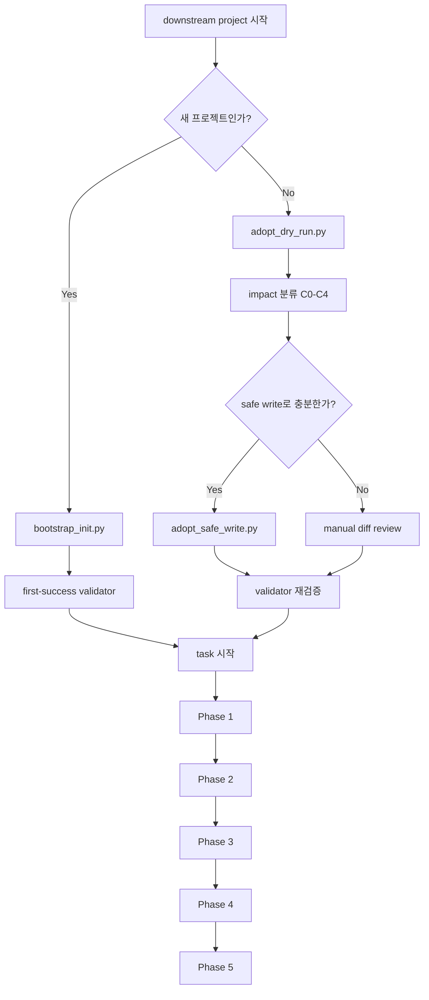
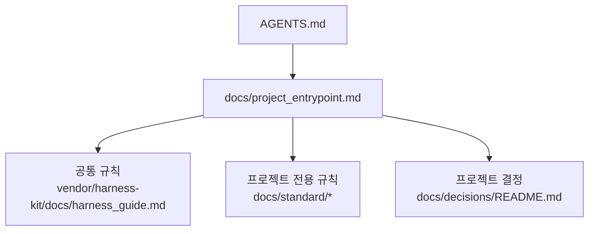
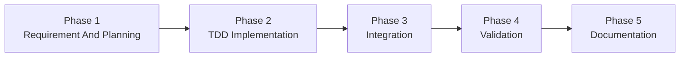
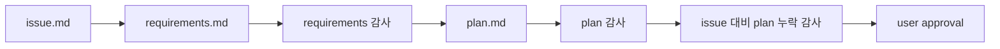
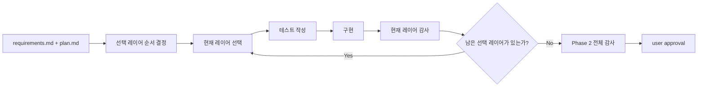
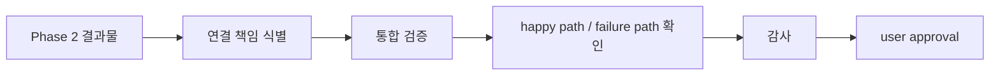
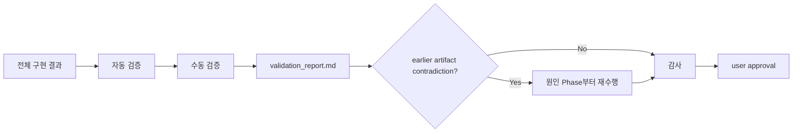
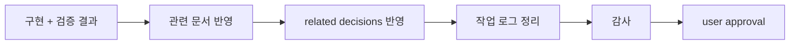

# Downstream Harness Flow

이 문서는 `harness-kit`를 bootstrap하거나 vendoring한 뒤, downstream 프로젝트 안에서 하네스가 어떤 순서와 규칙으로 동작하는지 설명한다.

## 문서 역할

- 이 문서는 downstream 사용 흐름 상세판이다.
- `README.md`가 시작 경로를 고르는 입구라면, 이 문서는 실제 downstream 구조와 Phase 흐름을 이어서 설명한다.
- source repo 자산과 downstream 생성 문서의 대응 관계가 먼저 필요하면 `README.md`의 `Source Repo 와 Downstream 관계` 표를 함께 본다.

## 언제 읽는가

- `harness-kit`를 새 프로젝트에 bootstrap하려 할 때
- 기존 프로젝트에 brownfield adoption을 적용하려 할 때
- downstream 프로젝트에서 task가 어떤 Phase 순서와 게이트로 진행되는지 한눈에 이해하고 싶을 때

## 하네스 도입 흐름

- 이 흐름은 downstream 프로젝트에서 하네스를 새로 bootstrap하거나, 기존 프로젝트에 brownfield adoption을 적용할 때의 도입 흐름이다.
- greenfield는 bootstrap으로 최소 문서 세트를 만들고 validator를 통과한 뒤 task를 시작한다.
- brownfield는 먼저 현재 상태를 읽고, impact 분류와 safe write 또는 manual review를 거친 뒤 validator를 다시 통과하고 task를 시작한다.
- 실제 task 운영 흐름은 아래 `Phase 전체 흐름`과 `Phase별 진행 흐름`이 설명한다.

## Bootstrap 이후 Downstream 상태

- 이 저장소는 bootstrap 전 source repo이고, 실제로 동작하는 하네스는 downstream 프로젝트 안에서 맞물린다.
- bootstrap 또는 vendoring이 끝나면 downstream 프로젝트 안에서 `AGENTS.md`, `docs/project_entrypoint.md`, `docs/standard/*`, `docs/decisions/README.md`, `vendor/harness-kit/docs/harness_guide.md`를 함께 읽는 구조가 된다.
- 자세한 bootstrap/adoption 절차는 `docs/quickstart.md`, `docs/project_overlay/first_success_guide.md`, `docs/project_overlay/adopt_dry_run.md`를 기준으로 본다.

## 프로젝트 진입점은 무엇을 하나

- `AGENTS.md`는 runtime launcher entrypoint다.
- downstream에서 실제 문서 규칙을 묶는 documentation/policy entrypoint는 `docs/project_entrypoint.md`다.
- 이 문서가 vendored core guide와 프로젝트 전용 문서를 함께 묶어서, 지금 프로젝트에서 무엇을 읽고 어떤 규칙으로 움직여야 하는지 정해 준다.
- 중요한 정책, 예외, 책임 배치 결정이 있으면 `docs/decisions/README.md`와 개별 decision 문서까지 함께 읽는다.

## Phase 전체 흐름

- 기본 순서는 `1 -> 2 -> 3 -> 4 -> 5`다.
- 각 Phase는 `implementation -> audit -> 사용자 승인 -> 다음 Phase` 순서를 따른다.
- validation에서 더 이른 산출물과 모순이 발견되면 원인 Phase까지 되돌아가고, 그렇지 않으면 영향이 걸린 가장 이른 Phase부터만 다시 수행한다.

## 변경 요청이 들어왔을 때

- 수정 요청, 범위 변경, close-out 방향 변경이 들어오면 먼저 가장 이른 영향 Phase를 다시 찾는다.
- task workspace에 `phase_status.md`가 있으면 그 파일의 현재 gate와 허용 write-set을 먼저 갱신한다.
- 이때 어떤 문서도 수정하기 전에 아래 3가지를 먼저 선언한다.
  1. 가장 이른 영향 Phase
  2. stale 처리되는 기존 감사 또는 사용자 승인
  3. 잠금 상태로 둘 stale 산출물
- 어떤 Phase 산출물이 수정되면 그 Phase의 감사는 stale 이 되고, 이미 승인된 상태였다면 승인도 stale 이 된다.
- 원인 Phase보다 뒤의 산출물은 stale 후보로 잠그고, 원인 Phase가 다시 승인되기 전에는 다음 Phase 문서, `validation_report.md`, final task-local 문서, close-out 문서, canonical 문서를 수정하지 않는다.
- 특정 Phase의 입력 문서나 핵심 산출물이 바뀌면 그 Phase 내부 절차는 최신본 기준으로 처음부터 다시 맞춘다.
- write-set 위반 가능성이 보이면 `scripts/validate_phase_gate.py`로 검사하고, 통과 전에는 다음 단계로 진행하지 않는다.

## Phase별 진행 흐름

### Phase 1. Requirement And Planning

- 입력은 `issue.md`다.
- 출력은 `requirements.md`, `plan.md`다.
- 실제 권장 순서는 `issue.md` 분석 -> `requirements.md` 작성 -> requirements 감사 -> `plan.md` 작성 -> plan 감사 -> issue 대비 plan 누락 감사다.
- 즉, 내부 감사 세 가지를 한 번에 몰아서 하는 것이 아니라, 각 산출물이 닫히는 시점마다 순서대로 수행한다.
- 세 내부 감사가 모두 승인 가능 상태가 된 뒤에만 사용자 승인으로 간다.
- `issue.md`, `requirements.md`, `plan.md` 중 하나라도 바뀌면 Phase 1 내부 감사 3종은 모두 stale 이 되며, 최신본 기준으로 다시 수행한다.
- Phase 1이 다시 승인되기 전에는 `validation_report.md`, final task-local 문서, `docs/decisions/*`를 수정하지 않는다.

### Phase 2. TDD Implementation

- 프로젝트별 실제 레이어 순서와 세분화 기준은 `docs/standard/implementation_order.md`가 정한다.
- Phase 2는 기능 전체를 한 번에 구현하는 것이 아니라, 현재 task에 필요한 레이어만 선택해 순서대로 진행한다.
- 각 선택 레이어는 `테스트 작성 -> 구현 -> 현재 레이어 감사` 순서를 따른다.
- 한 레이어 감사가 끝나면 다음 선택 레이어로 넘어가 같은 TDD 루프를 반복한다.
- 모든 선택 레이어가 끝난 뒤에야 `Phase 2 전체 감사`를 수행하고, 그 결과가 승인 가능 상태여야 사용자 승인 게이트로 간다.
- 승인된 `requirements.md` 또는 `plan.md`가 바뀌거나, 특정 레이어의 테스트/구현/경계가 바뀌면 그 레이어부터 `테스트 -> 구현 -> 감사`를 다시 수행하고, 이후 `Phase 2 전체 감사`도 최신본 기준으로 다시 수행한다.

### Phase 3. Integration

- 단위 테스트로 다루기 어려운 연결 책임, 조립 책임, 핵심 happy path와 failure path를 검증한다.
- 전체 앱 end-to-end만이 아니라 구현체 단위 통합 테스트도 포함될 수 있다.
- 통합 대상, 위임 책임, 연결 경계가 바뀌면 `연결 책임 식별 -> 통합 검증 -> happy path / failure path 확인 -> 감사` 순서를 최신본 기준으로 다시 수행한다.

### Phase 4. Validation

- `validation_report.md`가 핵심 출력이다.
- `validation_report.md`만 보완하면 기본적으로 Phase 4부터 다시 수행하지만, 더 이른 산출물과 모순되면 원인 Phase까지 되돌아간다.
- 검증 기준, 입력 산출물, 미실행 사유, 잔여 리스크가 바뀌면 자동/수동 검증과 감사는 모두 stale 로 보고 다시 수행한다.

### Phase 5. Documentation

- 구조적 결정, 사용법 변경, related decision을 실제 문서에 반영한다.
- 작업 로그는 이후 세션에서도 결과와 판단 근거를 복원할 수 있게 남긴다.
- 문서 반영 대상, canonical 역할 분담, close-out 결과가 바뀌면 문서 반영과 감사는 최신 Validation 결과 기준으로 다시 수행한다.
